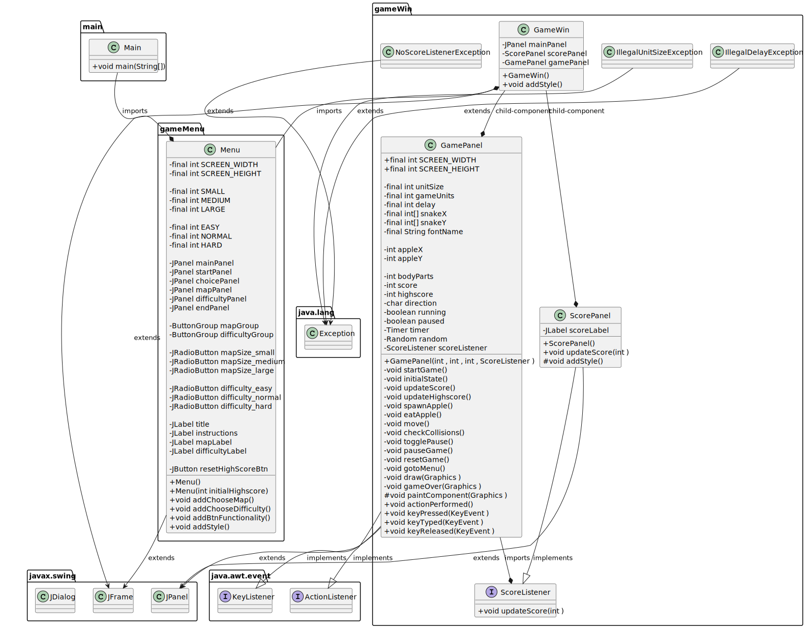
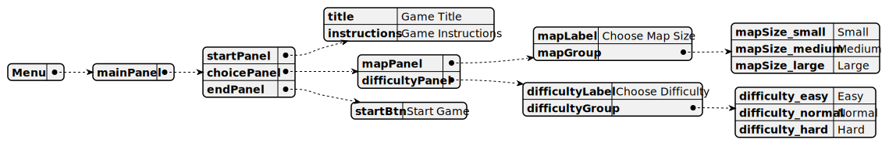

# Snake Game

## Group Members

| Name     | Roll no.      |
| -------- | ------------- |
| Shaheer  | 2021F-BCE-218 |
| Ammar    | 2021F-BCE-079 |
| Arshiyan | 2021F-BCE-089 |
| Shakoor  | 2021F-BCE-082 |

### Class Diagram



### Menu UI Diagram



### Game UI Diagram


The code is compiled with java version 19

To run this project: <br>
Either run this command

``` powershell
# Powershell
# Navigate to project folder
java -cp ".\lib\*;.\bin" main.Main
```

##### OR

Run powershell as admin

``` powershell
# Powershell as admin
Set-ExecutionPolicy RemoteSigned
```

Then

``` powershell
# Powershell
# Navigate to project folder
./runCode.ps1
```
